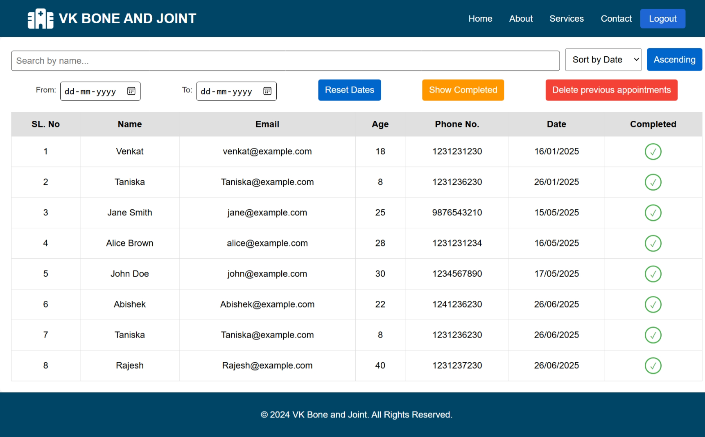
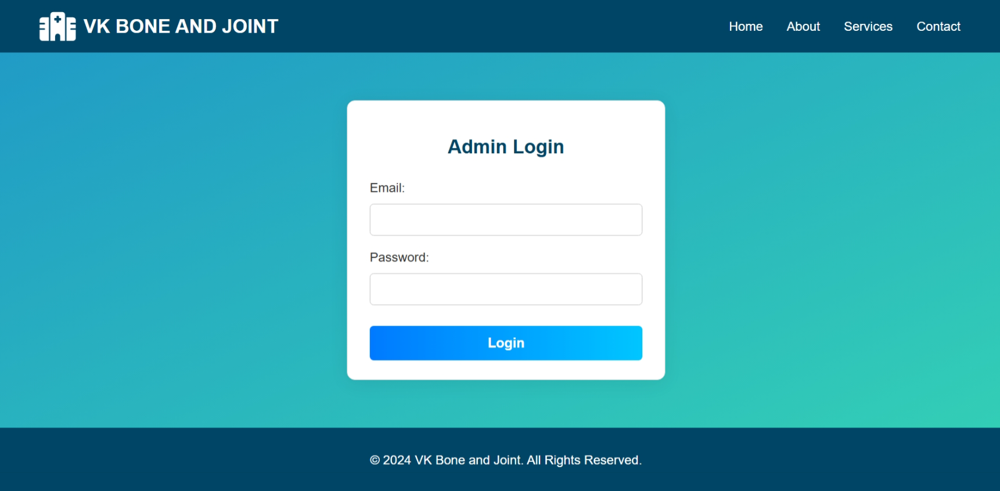

# Clinic Appointment Booking

A web application to book and manage clinic appointments efficiently.

## Features

- Patients can book, view, and cancel appointments
- Email confirmation sent to patients after booking
- Secure login for doctors only
- Admin dashboard to manage users and appointments

## Tech Stack

- **Backend:** Node.js, Express
- **Frontend:** React, CSS
- **Database:** MongoDB

## Prerequisites

- [Git](https://git-scm.com/)
- [Node.js](https://nodejs.org/)
- Create a `.env` file in the `clinic_appointment_booking/` directory with the following variables:
  - `MONGO_URI`
  - `EMAIL_APP_PASSWORD`
  - `EMAIL_ADMIN`

## Getting Started

1. **Clone the repository:**
   ```bash
   git clone https://github.com/Adhik-6/clinic_appointment_booking.git
   cd clinic_appointment_booking
   ```

2. **Install dependencies:**
   ```bash
   npm install
   ```

3. **Build the project:**
   ```bash
   npm run build
   ```

4. **Start the backend server:**
   ```bash
   npm run dev
   ```

5. **Start the frontend React app:**
   - Open a new terminal (keep the backend running).
   - Navigate to the `client` folder and run:
     ```bash
     cd client
     npm install
     npm run dev
     ```

## Usage

- Patients can book appointments online.
- Doctors (admins) can log in to manage appointments.
- View all appointments in a user-friendly table.
- Access the admin panel at `/admin-panel`.

## Screenshots



## TODO

- Create a new Google account (VK BONE AND JOINT)
- Obtain `MONGO_URI` and `EMAIL_APP_PASSWORD`
- Update admin email in the database
- Update the `.env` file accordingly